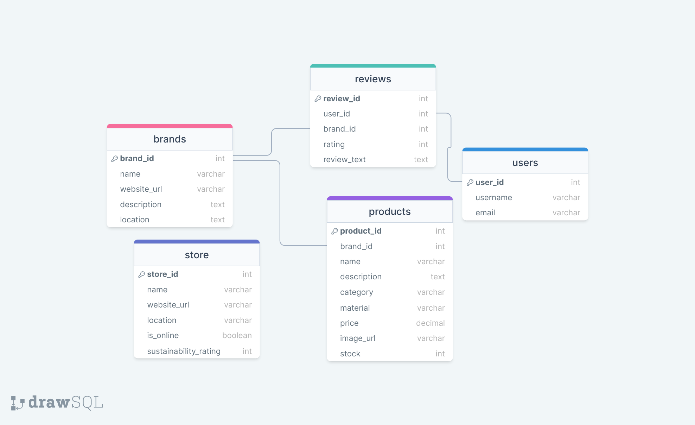

# Project Title
Eco-Fashion Marketplace
## Overview

Eco-Fashion Marketplace is a place to access brands that use eco-friendly materials for their fashion styles.

### Problem

Among the world's most polluting businesses is the fashion industry. The environment is harmed during the clothes manufacture process. This has compelled a lot of fashion businesses to use eco-friendly production techniques. Many of these fashion labels use organic cotton and upcycled resources to create high-end, eco-friendly apparel. 

Consumers, interested in purchasing sustainable fashion invest significant time  and effort into researching brands and their practices. They often resort to searching through various online platforms, reading product descriptions, and checking customer reviews to assess a brand's sustainability credentials. 

### User Profile

- Fashion enthusiasts:
    - looking for a sustainable fashion brands
    - looking for detailed information about each brand's sustainability initiatives
    - looking for desired fashion styles made from eco-friendly materials
    

### Features

- As a user, I want to be able to access different sustainable fashion brands
- As a user, I want to be able to have detailed information for each sustainable fashion brand including information about their mission, values, and their supply chain transparency
- As a user, I want to be able to get a desired fashion styles made from eco-friendly materials
- As a user, I want to be able to create an account 
- As a user, I want to be able to login into my account
- As a user, I want to be able to use the search and filter options to narrow down brands
- As a user, I want to be able to leave reviews and ratings for brands they have purchased from, helping to build trust and credibility 
- As a user, I want to be able to use this app on various devices and screen sizes to have a seamless user experience across desktop, tablet, and mobile devices

## Implementation

### Tech Stack

- React js
- SASS
- Node js
- MySQL

- Client libraries:
    - react
    - react-router
    - axios

- Server libraries:
    - Knex js
    - Express 
    
    
### APIs

- No external APIs will be used

### Sitemap

- Home page
- About Us page
- Contact page
- Fashion brand detailed page
- Sign Up
- Login

### Mockups

### Home Page


### Sign Up Page


### Login Page


### About Us Page


### Contact Us Page


### Fashion Brand Detailed Page


### Data



### Endpoints

List endpoints that your server will implement, including HTTP methods, parameters, and example responses.

**GET /brands**
  - Returns lists of brands

    ```Response:
    
        [
            {
                "id": 1,
                "name": "EcoThreads",
                "description": "Eco-friendly clothing brand commited to sustainable practices"
                "location": "Los Angeles, CA",
                "website": "https://www.ecothreads.com" 
            }
        ]
    ```

  **GET /brands/:id**
    - Returns a lists of brands with a specific ID.

    ```Response:
    
        [
            {
                "id": 1,
                "name": "EcoThreads",
                "description": "Eco-friendly clothing brand commited to sustainable practices"
                "location": "Los Angeles, CA",
                "website": "https://www.ecothreads.com" 
            }
        ]
    ```

 **POST /brands**
    - creates and returns the new brands created

    ```Response:
    
        [
            {
                "id": 1,
                "name": "EcoThreads",
                "description": "Eco-friendly clothing brand commited to sustainable practices"
                "location": "Los Angeles, CA",
                "website": "https://www.ecothreads.com" 
            }
        ]
    ```


 **PUT /brands/:id**
    - updates the brand with specific ID and returns the updated brand

    ```Response:
    
        [
            {
                "id": 1,
                "name": "EcoThreads",
                "description": "Eco-friendly clothing brand commited to sustainable practices"
                "location": "Los Angeles, CA",
                "website": "https://www.ecothreads.com" 
            }
        ]
    ```

 **GET /products**
   - Returns lists of products
    ```Response:
    
        [
            {
                "id": 101,
                "name": "Organic Cotton T-Shirt",
                "price": $29.99,
                "image": "https://www.ecothreads.com/images/organic-cotton-tshirt.jpg" 
            }
        ]
    ```

     **GET brands/products/:id**
     - Returns a lists of brands with a specific ID.
        
        ```Response:
    
        [
            {
                "id": 101,
                "name": "Organic Cotton T-Shirt",
                "brand": "EcoThreads",
                "description" A comfortableand breathable t-shirt made from 100% organic cotton",
                "price": $29.99,
                "image": "https://www.ecothreads.com/images/organic-cotton-tshirt.jpg" 
                "sizes": ["S", "M", "L", "XL"],
                "colors": ["White", "Black", "Gray", "Navy"]
            }
        ]
    ```
       

### Auth

- JWT auth (JSON WEB TOKEN)
    - After a user signs up by providing personal information
    - User authenticates by providing neccessary credentials for login
    - After successful authentication, the server will generate token
    - The token information will be sent to the client
    - The token is later stored in local storage by the client
    - The token is discarded when the user logged out

## Roadmap

- Create the folder structure for client
    - Set up the client side using React js by creating components, routes and pages
    - Implement the html layout and styling
    - Add functionality to the site
    - Authenticate and Authorize the sign up and login page

- Create the folder structure for server
    - Set up the server side using Node js with express framework
    -  Gather sample data for different fashion brands that use eco-friendly materials
    - Set up the routing and controllers
    - Set up migrations 
    - Set up seeds with sample of data
    - Create database on MySQL
    - Implement CRUD operations (Create, Read, Update and Delete)
    - Use Endpoints such as, GET, POST, PUT and DELETE to access the database table


## Nice-to-haves

 
 - Interactive Map : Allowing users to easily find the nearby stores or online retailers
 
 - Personalized Recommendation : suggests brands based on user's preferences, purchase histoey and sustainability priorities

 - Shooping Cart and Checkout page
 
